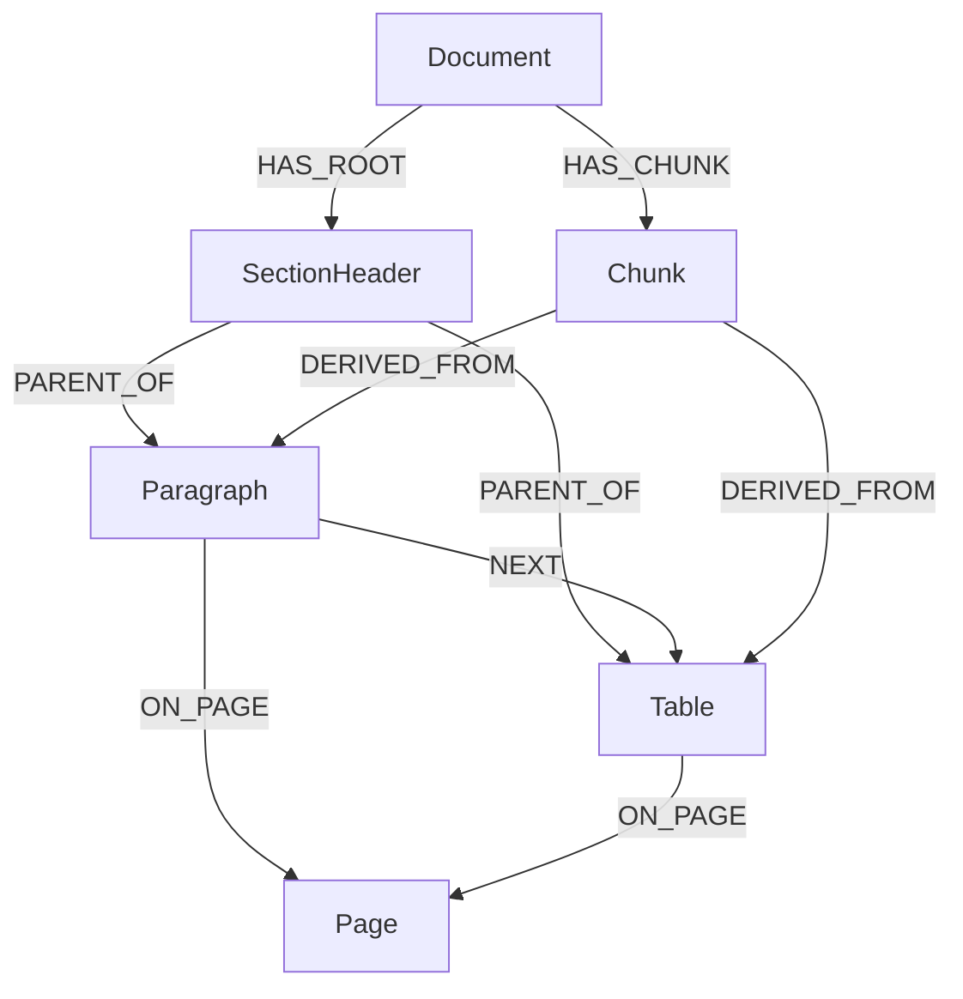

# Docling Studio


[](https://github.com/scub-france/Docling-Studio)

A visual document analysis studio powered by [Docling](https://github.com/DS4SD/docling).
Upload a PDF, configure the extraction pipeline, and visualize the results — text, tables, images, formulas, bounding boxes — all from your browser.


## Star History

<a href="https://www.star-history.com/?repos=scub-france%2FDocling-Studio&type=timeline&legend=top-left">
 <picture>
   <source media="(prefers-color-scheme: dark)" srcset="https://api.star-history.com/chart?repos=scub-france/Docling-Studio&type=timeline&theme=dark&legend=top-left" />
   <source media="(prefers-color-scheme: light)" srcset="https://api.star-history.com/chart?repos=scub-france/Docling-Studio&type=timeline&legend=top-left" />
   
 </picture>
</a>

## Features

- **Home page** with quick upload and recent documents
- **PDF viewer** with page navigation, bounding box overlay, and resizable results panel
- **Configurable Docling pipeline** — OCR, table extraction, code/formula enrichment, picture classification & description, image generation
- **Bounding box visualization** — color-coded element overlay directly on the PDF
- **Per-page results** — right panel syncs with the current PDF page
- **Chunking** — split extracted content into semantic chunks (hierarchical, hybrid, or page-based) with configurable token limits and inline editing
- **Ingestion pipeline** — Docling → chunking → embedding → OpenSearch vector indexing (one-click from Studio)
- **Graph storage (Neo4j)** — full DoclingDocument tree (sections, paragraphs, tables, pages, chunks) mirrored as a graph with `PARENT_OF`, `NEXT`, `ON_PAGE`, `HAS_CHUNK`, `DERIVED_FROM` relations, with an in-app graph view powered by Cytoscape.js
- **Markdown & HTML export** of extracted content
- **Document management** — upload, list, delete, search, filter by indexing status
- **Analysis history** — re-visit and open past analyses
- **Upload limits** — configurable max file size and max page count per document
- **Rate limiting** — configurable requests per minute per IP
- **Dark / Light theme** and **FR / EN** localization


## Architecture

```
┌────────────┐         ┌──────────────────────┐
│  Frontend  │────────▶│   Document Parser    │
│  Vue 3     │  /api/* │ FastAPI + Docling    │
│  port 3000 │         │ SQLite + file storage│
└────────────┘         │   port 8000          │
                       └──────────────────────┘
```

| Service | Stack | Role |
|---------|-------|------|
| **frontend** | Vue 3, TypeScript, Vite, Pinia | UI, PDF viewer, results display |
| **document-parser** | FastAPI, Docling, SQLite, pdf2image | REST API, document parsing, storage |

### Backend structure (hexagonal architecture — ports & adapters)

```
document-parser/
├── main.py                   # FastAPI app, CORS, lifespan
├── domain/                   # Pure domain — no HTTP, no DB
│   ├── models.py             # Document, AnalysisJob dataclasses
│   ├── ports.py              # Abstract protocols (converter, chunker)
│   └── value_objects.py      # ConversionResult, PageDetail, ChunkResult
├── api/                      # HTTP layer (FastAPI routers)
│   ├── schemas.py            # Pydantic DTOs (camelCase serialization)
│   ├── documents.py          # /api/documents endpoints
│   └── analyses.py           # /api/analyses endpoints
├── persistence/              # Data layer (SQLite via aiosqlite)
│   ├── database.py           # Connection management, schema init
│   ├── document_repo.py      # Document CRUD
│   └── analysis_repo.py      # AnalysisJob CRUD
├── services/                 # Use case orchestration
│   ├── document_service.py   # Upload, delete, preview
│   └── analysis_service.py   # Async Docling processing
└── tests/                    # 377 tests (pytest)
```

### Frontend structure (feature-based)

```
frontend/src/
├── app/                      # App shell, router, global styles
├── pages/                    # Route-level pages
│   ├── HomePage.vue          # Landing page with upload & stats
│   ├── StudioPage.vue        # PDF viewer + config + results
│   ├── DocumentsPage.vue     # Document management
│   ├── HistoryPage.vue       # Past analyses
│   └── SettingsPage.vue      # Theme, language, API URL
├── features/                 # Feature modules
│   ├── analysis/             # Analysis store, API, bbox, UI components
│   ├── document/             # Document store, API, upload, list
│   ├── history/              # History store, API, navigation
│   └── settings/             # Settings store
└── shared/                   # Shared utilities (types, i18n, http, format)
```

## Quick Start

One command, nothing else to install:

```bash
docker run -p 3000:3000 ghcr.io/scub-france/docling-studio:latest-local
```

Open [http://localhost:3000](http://localhost:3000), upload a PDF, and get results. That's it.

> **Note:** The first analysis takes longer as Docling downloads its ML models (~400 MB). Subsequent runs are fast.

### Image variants

| Variant | Image tag | Size | Description |
|---------|-----------|------|-------------|
| **local** | `latest-local` | ~1.9 GB | Full — runs Docling in-process, CPU-only |
| **remote** | `latest-remote` | ~270 MB | Lightweight — delegates to an external [Docling Serve](https://github.com/DS4SD/docling-serve) instance |

For remote mode:

```bash
docker run -p 3000:3000 \
  -e DOCLING_SERVE_URL=http://your-docling-serve:5001 \
  ghcr.io/scub-france/docling-studio:latest-remote
```

### Docker Compose

```bash
git clone https://github.com/scub-france/Docling-Studio.git
cd Docling-Studio

# Simple mode (backend + frontend only)
docker compose up --build

# With ingestion pipeline (OpenSearch + embeddings)
docker compose --profile ingestion -f docker-compose.yml -f docker-compose.ingestion.yml up --build
```

### Local Development

**Backend** (Python 3.12+):
```bash
cd document-parser
python -m venv .venv && source .venv/bin/activate

# Remote mode (lightweight)
pip install -r requirements.txt

# Local mode (with Docling)
pip install -r requirements-local.txt

uvicorn main:app --reload --port 8000
```

**Frontend** (Node 20+):
```bash
cd frontend
npm install
npm run dev
```

### Running Tests

```bash
# Backend (377 tests)
cd document-parser
pip install pytest pytest-asyncio httpx
pytest tests/ -v

# Frontend (156 tests)
cd frontend
npm run test:run
```

## Pipeline Options

These options map directly to Docling's [`PdfPipelineOptions`](https://docling-project.github.io/docling/usage/). See the [Docling documentation](https://docling-project.github.io/docling/) for details on each feature.

| Option | Default | Description |
|--------|---------|-------------|
| `do_ocr` | `true` | OCR for scanned pages and embedded images |
| `do_table_structure` | `true` | Table detection and row/column reconstruction |
| `table_mode` | `accurate` | `accurate` (TableFormer) or `fast` |
| `do_code_enrichment` | `false` | Specialized OCR for code blocks |
| `do_formula_enrichment` | `false` | Math formula recognition (LaTeX output) |
| `do_picture_classification` | `false` | Classify images by type (chart, photo, diagram…) |
| `do_picture_description` | `false` | Generate image descriptions via VLM |
| `generate_picture_images` | `false` | Extract detected images as separate files |
| `generate_page_images` | `false` | Rasterize each page as an image |
| `images_scale` | `1.0` | Scale factor for generated images (0.1–10) |

## Configuration

All configuration is done via environment variables. See [`.env.example`](.env.example).

| Variable | Default | Description |
|----------|---------|-------------|
| `CONVERSION_ENGINE` | `local` | `local` (in-process Docling) or `remote` (Docling Serve) |
| `DOCLING_SERVE_URL` | `http://localhost:5001` | Docling Serve endpoint (remote mode only) |
| `DOCLING_SERVE_API_KEY` | — | API key for Docling Serve (optional) |
| `CORS_ORIGINS` | `http://localhost:3000,...` | CORS allowed origins (comma-separated) |
| `UPLOAD_DIR` | `./uploads` | File storage directory |
| `DB_PATH` | `./data/docling_studio.db` | SQLite database path |
| `CONVERSION_TIMEOUT` | `600` | Max seconds for a single Docling conversion |
| `BATCH_PAGE_SIZE` | `10` | Pages per batch (`0` = process all at once) |
| `MAX_FILE_SIZE_MB` | `50` | Maximum upload file size in MB (`0` = unlimited) |
| `MAX_PAGE_COUNT` | `0` | Maximum number of pages per document (`0` = unlimited) |
| `NGINX_MAX_BODY_SIZE` | `200M` | Nginx request body limit — nginx format (`200M`, `0` = unlimited). Must be ≥ `MAX_FILE_SIZE_MB`. |
| `RATE_LIMIT_RPM` | `100` | Max requests per minute per IP (`0` = disabled) |

## Upload Limits

Docling Studio enforces configurable limits on uploaded documents to protect the server against oversized files and long-running analyses:

- **`MAX_FILE_SIZE_MB`** (default `50`) — rejects uploads exceeding this size. Validated at two levels: early `Content-Length` check and streaming byte count.
- **`MAX_PAGE_COUNT`** (default `0` = unlimited) — rejects documents with more pages than allowed. Useful on shared instances or Hugging Face Spaces to cap processing time.
- **`NGINX_MAX_BODY_SIZE`** (default `200M`) — nginx-level body cap, applied before the request reaches the backend. Defaults to `200M` so `MAX_FILE_SIZE_MB` is always the effective limit. Use nginx format (`50M`, `1G`, `0` for unlimited).

Both application limits are exposed in the `/api/health` endpoint so the frontend can display them to the user before upload. Set either to `0` to disable the corresponding check.

## Ingestion Pipeline (opt-in)

Docling Studio can optionally index extracted chunks into [OpenSearch](https://opensearch.org/) for vector and full-text search. This requires two additional services (OpenSearch + embedding) and is **disabled by default**.

To enable ingestion with Docker Compose:

```bash
docker compose --profile ingestion \
  -f docker-compose.yml -f docker-compose.ingestion.yml \
  up --build
```

When ingestion is enabled, the UI shows:
- An **Ingest** button in Studio to push chunks to OpenSearch
- An **OpenSearch** connection status badge in the sidebar
- **Indexed / Not indexed** filters on the Documents page
- A **Search** page for full-text and vector search across indexed documents

| Variable | Default | Description |
|----------|---------|-------------|
| `OPENSEARCH_URL` | — | OpenSearch endpoint (empty = ingestion disabled) |
| `EMBEDDING_URL` | — | Embedding service endpoint (empty = ingestion disabled) |
| `EMBEDDING_DIMENSION` | `384` | Vector dimension (must match embedding model) |

## Graph storage with Neo4j (opt-in)

Docling Studio can mirror the full **DoclingDocument tree** into a [Neo4j](https://neo4j.com/) graph: sections, paragraphs, tables, figures, pages, and chunks all become first-class nodes connected by `HAS_ROOT`, `PARENT_OF`, `NEXT`, `ON_PAGE`, `HAS_CHUNK`, and `DERIVED_FROM` edges. This enables queries that are impossible with a flat chunk store — navigating a document's outline, finding all tables under a given section, or tracing a chunk back to its source elements.

Enable Neo4j with the ingestion profile (it ships alongside OpenSearch):

```bash
docker compose --profile ingestion \
  -f docker-compose.yml -f docker-compose.ingestion.yml \
  up --build
```

The Neo4j Browser is available at <http://localhost:7474> (user `neo4j`, password `changeme` by default).

### Schema at a glance



### Example Cypher queries

Find all "Methods" sections across documents (impossible in vector-only stores):

```cypher
MATCH (d:Document)-[:HAS_ROOT]->(:Element)-[:PARENT_OF*]->(s:SectionHeader)
WHERE toLower(s.text) CONTAINS 'method'
RETURN d.title, s.text, s.level
```

Get the parent section and sibling elements of a chunk (context for RAG):

```cypher
MATCH (c:Chunk {id: $chunk_id})-[:DERIVED_FROM]->(e:Element)
MATCH (e)<-[:PARENT_OF]-(parent:Element)-[:PARENT_OF]->(sibling:Element)
RETURN parent, collect(sibling) AS siblings
```

List all tables from documents ingested from an `invoices/` path:

```cypher
MATCH (d:Document)-[:HAS_ROOT]->(:Element)-[:PARENT_OF*]->(t:Table)
WHERE d.source_uri CONTAINS 'invoices/'
RETURN d.title, t.caption, t.cells_json
```

| Variable | Default | Description |
|----------|---------|-------------|
| `NEO4J_URI` | — | Neo4j Bolt endpoint (empty = graph storage disabled) |
| `NEO4J_USER` | `neo4j` | Neo4j username |
| `NEO4J_PASSWORD` | `changeme` | Neo4j password |

The in-app **Graph** tab (under *Results*) renders the per-document graph with [Cytoscape.js](https://js.cytoscape.org/) (see [ADR-001](docs/architecture/adrs/ADR-001-graph-visualization-library.md) for the library choice). Documents with more than **200 pages** return `HTTP 413` from `GET /api/documents/{id}/graph`; pagination ships in v0.6.

## Live Reasoning (opt-in, R&D)

Docling Studio can run [docling-agent](https://github.com/docling-project/docling-agent)'s Chunkless RAG loop against an analyzed document and return a full **reasoning trace** — the path the agent walked through the document outline, with the section reference / rationale / answer for each iteration. The trace is overlaid on the document graph so you can *see* how the agent navigated the structure.

Disabled by default — pulls heavy deps (`docling-agent`, `mellea`, ~60 MB) and needs a reachable Ollama instance with the target model already pulled.

### Enable

```bash
export REASONING_ENABLED=true
export OLLAMA_HOST=http://localhost:11434      # default
export REASONING_MODEL_ID=gpt-oss:20b           # any model already pulled in Ollama
# Optional, future-proof — only "ollama" is realizable today (see Architecture below):
export LLM_PROVIDER_TYPE=ollama
```

Then `pip install docling-agent mellea` (or rebuild the `local` Docker image with `--build-arg WITH_REASONING=true` to bundle them) and restart the backend. The frontend reads `reasoningAvailable` from `/api/health` and hides the **Reasoning** sidebar entry when the runner isn't wired — so users never click through to a 503.

> **Note** — since #254, the standard `latest-local` image no longer ships `docling-agent` / `mellea`. Build a separate variant when you need them:
> ```bash
> docker build --target local --build-arg WITH_REASONING=true \
>   -t docling-studio-backend:local-reasoning ./document-parser
> ```
> Or with compose: `WITH_REASONING=true docker compose up --build`.

| Variable | Default | Description |
|----------|---------|-------------|
| `REASONING_ENABLED` | `false` | Master switch — `true` to enable the live runner |
| `OLLAMA_HOST` | `http://localhost:11434` | Ollama daemon URL |
| `REASONING_MODEL_ID` | `gpt-oss:20b` | Default model id (per-call override allowed via the API) |
| `LLM_PROVIDER_TYPE` | `ollama` | LLM backend selector — only `ollama` is supported today |

### Architecture

The reasoning subsystem is wired through a `ReasoningRunner` port (`document-parser/domain/ports.py`) and an `LLMProvider` abstraction:

- `domain/ports.py` defines `ReasoningRunner`, `LLMProvider`, `ReasoningParseError` (no third-party imports)
- `domain/value_objects.py` defines `LLMProviderType`, `ReasoningResult`, `ReasoningIteration`
- `infra/llm/ollama_provider.py` implements `LLMProvider` for Ollama
- `infra/docling_agent_reasoning.py` implements `ReasoningRunner` using docling-agent + mellea — all upstream coupling is here, including the `_rag_loop` workaround tracked at [docling-agent#26](https://github.com/docling-project/docling-agent/issues/26)
- `api/reasoning.py` consumes `app.state.reasoning_runner` — zero coupling to docling-agent

This makes alternate LLM backends a question of adding new `LLMProvider` adapters once docling-agent (or a replacement) supports them upstream.

## CI / Release

GitHub Actions pipelines (see [`.github/workflows/`](.github/workflows/)):

| Workflow | Trigger | What it does |
|----------|---------|--------------|
| **CI** | push to `main`, pull requests | Lint + type check + Backend tests + Frontend tests + build |
| **Release** | push tag `v*` | Build & push **two** multi-arch Docker images (`remote` + `local`) to `ghcr.io` |
| **Docs** | push to `main` (docs changes) | Build & deploy MkDocs to GitHub Pages |

We follow [Semantic Versioning](https://semver.org/) with a simplified Git Flow. See [CONTRIBUTING.md](CONTRIBUTING.md) for the full release process.

## Performance & System Requirements

| Document type | Pages | Approx. time (CPU) |
|---------------|-------|---------------------|
| Simple report | 5–10  | ~30s–1 min |
| Research paper | 10–30 | ~1–2 min |
| Large document | 100+  | ~2–5 min |

### Docker Desktop settings

| | Remote image | Local image |
|---|---|---|
| **Image size** | ~270 MB | ~1.9 GB |
| **Memory** | 2 GB | 6 GB (recommended 8 GB+) |
| **CPUs** | 2 | 4 (recommended 8+) |

### Platform support

All Docker images are multi-arch (linux/amd64 + linux/arm64). No GPU required.

## Tech Stack

- **Frontend**: Vue 3, TypeScript, Vite, Pinia, DOMPurify
- **Backend**: FastAPI, Docling 2.x, SQLite (aiosqlite), pdf2image
- **CI**: GitHub Actions
- **Infra**: Docker Compose + Nginx

## Contributing

Contributions are welcome! Please open an issue first to discuss what you'd like to change.

## License

[MIT](LICENSE) — Pier-Jean Malandrino
