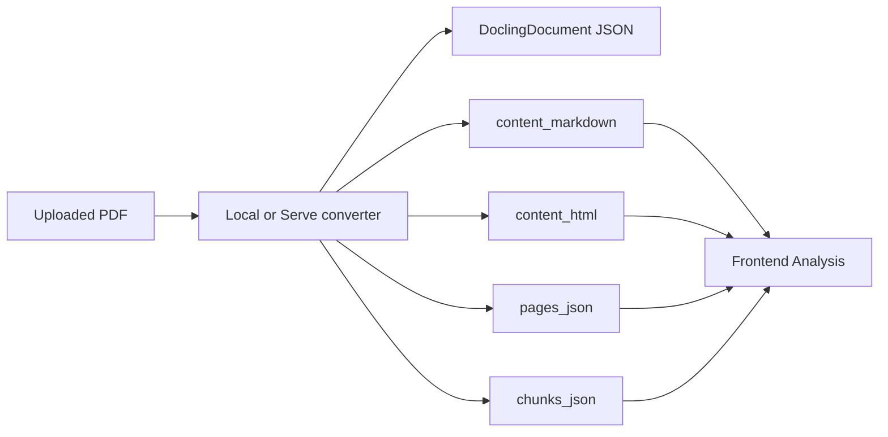
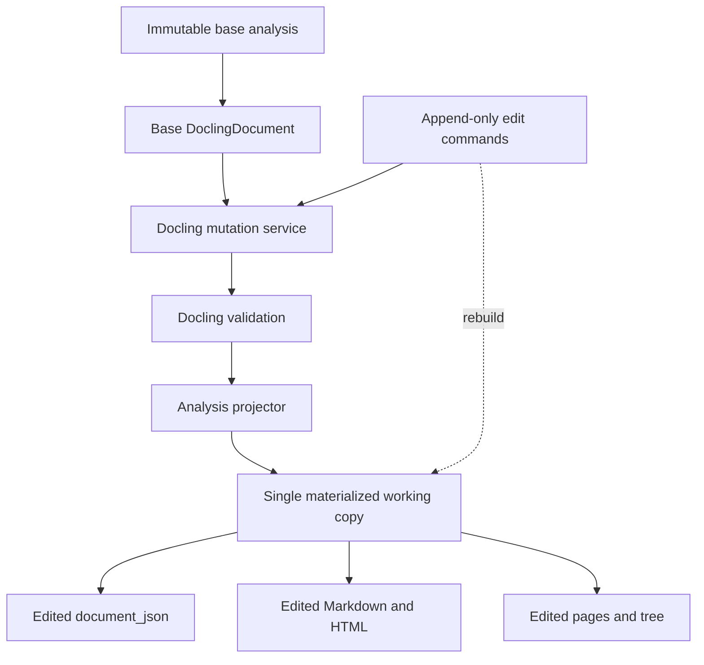
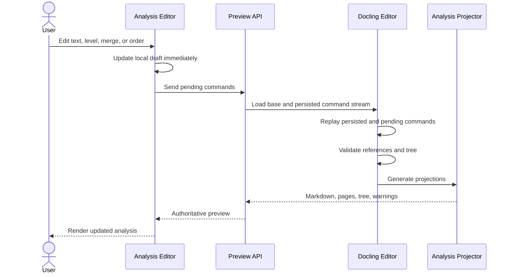
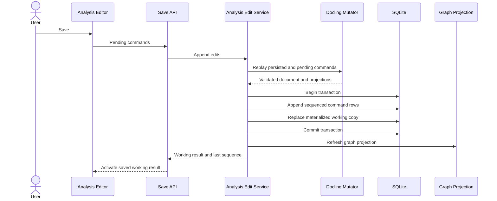
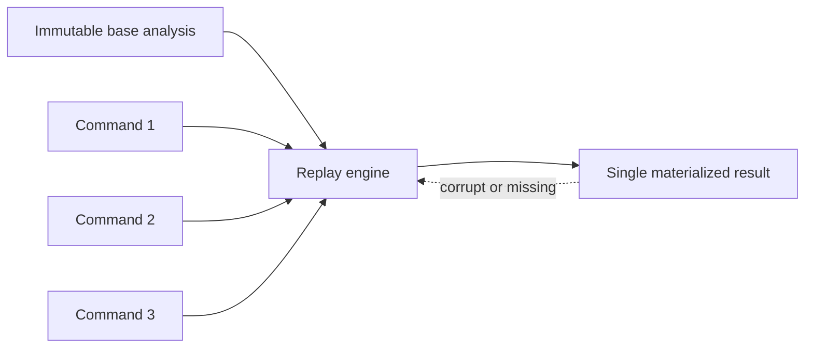
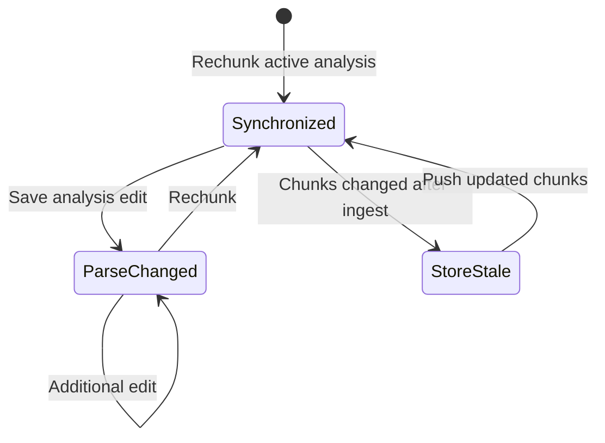

# Analysis Editor Design
# Analysis Editor Design

## Objective

Implement an editor that allows users to:

- Edit extracted text.
- Combine adjacent text elements.
- Change heading levels.
- Reorder the document reading order.
- Preview the resulting analysis before saving.
- Materialize edits as a valid edited Docling document.
- Preserve every user edit as a durable, replayable command.
- Keep only one materialized edited result per base analysis.

The editor will initially target a single user. Real-time collaboration and conflict resolution are out of scope.

## Current Architecture

An analysis currently stores several representations of the same conversion:

| Field | Purpose |
|---|---|
| `document_json` | Full serialized `DoclingDocument` |
| `content_markdown` | Markdown exported by Docling |
| `content_html` | HTML exported by Docling |
| `pages_json` | Frontend page elements and bounding boxes |
| `chunks_json` | Legacy analysis-level chunks |

The frontend `Analysis` object contains the rendered projections, but not `document_json`.



These fields can drift if the frontend projections are edited independently. Therefore, they must not be separate editable sources.

## Primary Decision

The immutable conversion analysis and its serialized `DoclingDocument` are the base source. The ordered, append-only edit command stream is the authoritative record of user intent.

The backend replays the command stream against the selected immutable base document, validates the result, and regenerates every affected projection. It stores one materialized working copy per base analysis so normal reads do not need to replay the stream. Each working copy is replaceable and can always be rebuilt from its base analysis and commands.



The frontend must never save changes directly to `pages_json`, Markdown, HTML, or raw Docling JSON.

The command stream is not a disposable audit log. It is durable domain data and must contain everything needed to reproduce the edited result.

## Editing Model

The backend exposes a normalized representation suitable for editing:

```ts
interface AnalysisEditorModel {
  baseAnalysisId: string
  documentId: string
  appliedThroughSequence: number
  elements: EditorElement[]
}

interface EditorElement {
  id: string
  selfRef: string
  parentRef: string | null
  type: string
  text: string | null
  headingLevel: number | null
  children: string[]
  provenance: EditorProvenance[]
  editable: boolean
}

interface EditorProvenance {
  page: number
  bbox: [number, number, number, number]
}
```

The `id` is a durable logical element ID, not a mutable Docling `self_ref`. Initial IDs are deterministically derived from the base analysis ID and original `self_ref`. A merge retains the first element's logical ID. If future operations create elements, the server assigns persistent IDs.

Every command references logical IDs. During replay, the editor engine maps them to the current Docling objects. This prevents Docling reference renumbering after merges and deletions from invalidating later commands.

## Edit Commands

The implementation supports the following commands.

```ts
type AnalysisEditCommand =
  | {
      type: 'replaceText'
      elementId: string
      text: string
    }
  | {
      type: 'mergeText'
      elementIds: string[]
      separator: string
    }
  | {
      type: 'setHeadingLevel'
      elementId: string
      level: number
    }
  | {
      type: 'moveElement'
      elementId: string
      beforeElementId: string | null
    }
  | {
      type: 'deleteElement'
      elementId: string
    }
```

### Replace Text

- Updates `TextItem.text`.
- Keeps `TextItem.orig` unchanged as the original OCR evidence.
- Preserves provenance, bounding boxes, parent, and reading order.
- Supports paragraphs, headings, captions, formulas, code, and list items where Docling permits it.

### Combine Texts

The initial implementation should only merge compatible adjacent sibling text elements.

Rules:

- Elements must be adjacent in reading order.
- Elements must have the same parent.
- Elements must be leaf text items.
- Elements with incompatible labels cannot be merged.
- Tables, pictures, groups, and structural containers cannot be merged.
- The first element becomes the destination.
- Text is joined using the supplied separator.
- Original OCR values are joined and retained in `orig`.
- Provenance entries are preserved.
- Source items are removed through Docling's item deletion API.
- Docling is allowed to renumber internal references.

The preview response returns the resulting references, so the UI can refresh after saving.

Merge behavior should follow Docling's deterministic reading-order rules where applicable:

- Remove soft hyphens and valid hard-hyphen word breaks.
- Preserve provenance for continuation text.
- Preserve `orig` consistently.
- Clear hyperlinks when merged items have different hyperlinks.

### Change Heading Level

- Applies only to `SectionHeaderItem`.
- Initially supports levels 1 through 6.
- A section header can be converted to body text (`-1`) or the document title (`0`).
- Conversion to title is rejected when another title already exists.
- The section hierarchy is normalized after applying heading changes.
- Content underneath a heading moves with its section subtree.

The implementation uses `DoclingDocument.replace_item()` so top-level collections and
tree references remain synchronized.

### Delete Element

- Deletes a selected item and its children with `DoclingDocument.delete_items()`.
- The document root cannot be deleted.
- Deletion is durable, previewable, and included in history.

### Reorder Reading Order

The implementation reorders elements or section subtrees among siblings.

Rules:

- Moving a heading moves its entire section subtree.
- Moving an element cannot create a parent cycle.
- Internal picture, table, inline, and list structures cannot be broken.
- Provenance and bounding boxes do not move because they describe the original PDF location.
- Cross-parent movement is deferred until the sibling-reordering behavior is stable.

Docling does not currently expose a public subtree move method. The implementation
uses the private `DoclingDocument._move_subtree()` helper because it atomically updates
the old parent, new parent, and moved item's parent reference. This dependency should
be covered by compatibility tests when upgrading `docling-core`.

This means visual position on the PDF and semantic reading order can differ after editing. The UI should make that distinction explicit.

## Preview Flow

Previewing must use the same backend mutation and projection code as saving.



The UI can debounce preview requests by approximately 300 to 500 milliseconds.

Local state provides immediate interaction feedback. The backend response remains authoritative.

## Save Flow

Saving appends commands and replaces the single materialized working copy. It does not create another full analysis row.



All projections must be produced successfully before beginning the database transaction.

The command append and working-copy replacement must be atomic. A command must never be reported as saved unless the corresponding materialized result was persisted, and a working copy must never include commands absent from the stream.

Graph storage is a rebuildable projection and can be updated after commit. A graph refresh failure should be logged and retried without losing the saved commands.

## Durable Stream and Working Copy

Each conversion analysis remains immutable. Commands are append-only and small. Exactly one materialized edited result is stored for each conversion analysis.



The command sequence is sufficient to rebuild the working copy from scratch. The materialized copy exists for performance and availability, not as the authoritative edit history.

Each command record includes a schema version. The replay engine must retain handlers for supported command versions or migrate old commands before dropping a handler. The stream also records the base analysis and editor-engine version so upgrades can be tested for replay compatibility.

A new conversion creates a new base analysis and a new edit stream because element identities may differ. Previous command streams remain archived as lightweight user data. Restoring an older base can rebuild its edited state from its associated stream without retaining another full working copy.

### Reconstruction Guarantee

The reconstruction contract is:

```text
immutable base document
+ commands ordered by sequence
+ versioned command semantics
= equivalent normalized edited DoclingDocument
```

The base document hash, canonical command-stream hash, and materialized result hash should be persisted. A rebuild verifies all three. Byte-for-byte output is not required across serializer upgrades, but the normalized Docling model, reading order, text, hierarchy, provenance, and generated projections must remain equivalent.

Commands must never be destructively compacted. A future checkpoint may accelerate replay, but it is an optional cache and cannot replace or delete the underlying user commands.

## Persistence Changes

### Edit Streams

Add an `analysis_edit_streams` table:

| Column | Purpose |
|---|---|
| `id` | Stable stream identifier |
| `document_id` | Owning document |
| `base_analysis_id` | Immutable conversion analysis used for replay |
| `base_document_hash` | Integrity hash of the immutable replay input |
| `editor_engine_version` | Replay semantics version |
| `created_at` | Stream creation time |

Add an append-only `analysis_edit_commands` table:

| Column | Purpose |
|---|---|
| `id` | Stable command identifier |
| `stream_id` | Owning edit stream |
| `sequence` | Strict replay order, unique within the stream |
| `command_version` | Payload schema and behavior version |
| `command_type` | `replaceText`, `mergeText`, `setHeadingLevel`, or `moveElement` |
| `payload_json` | Complete command payload using logical element IDs |
| `command_hash` | Hash chained with the previous command for integrity |
| `created_at` | Time the user saved the command |

Command rows are never updated or deleted as part of normal editing. A correction is another command. Undo, if added later, should append a compensating command rather than rewriting history.

### Materialized Working Copy

Add an `analysis_working_copies` table with one row per edit stream/base analysis:

| Column | Purpose |
|---|---|
| `stream_id` | Primary key; stream used to build the copy |
| `document_id` | Owning document |
| `base_analysis_id` | Immutable replay base |
| `applied_through_sequence` | Last included command |
| `document_json` | Materialized edited `DoclingDocument` |
| `content_markdown` | Materialized Markdown projection |
| `content_html` | Materialized HTML projection |
| `pages_json` | Materialized page projection |
| `command_stream_hash` | Hash of the stream used to build this row |
| `result_hash` | Hash of the normalized edited result |
| `updated_at` | Last successful rebuild or save |

The row is updated in place after successful validation. It may be deleted and rebuilt without losing user edits.

### Active Result

Add `active_analysis_id` to `documents` to identify the immutable base analysis. The active displayed result is the working copy when it belongs to that base; otherwise it is the base analysis itself.

This replaces relying on "latest completed by timestamp" when a service needs the active result.

Services that should use the active result include:

- Document tree.
- Markdown and JSON export.
- Rechunking.
- Reasoning.
- In-memory graph projection.
- Workspace loading.

Restoring a History version must update `active_analysis_id` on the backend, not only in frontend memory. If that base has an edit stream, the user can activate its latest replayed state or the untouched base. A save does not create a heavy `document_versions` snapshot.

## Chunks and Downstream State

Saving a parse edit does not automatically regenerate chunks.

Automatic rechunking would be surprising, potentially slow, and cannot currently reuse the previous strategy because chunking options are not persisted.

Instead, track the exact result that produced the live chunkset:

- Store `chunks_source_analysis_id` and `chunks_source_edit_sequence` on the document or canonical chunkset metadata.
- Set it when chunks are generated.
- Compare it with the active base analysis and working-copy sequence.
- Expose `chunksStale` through the document API.



After saving an analysis edit:

- The analysis preview, exports, tree, graph, and reasoning use the updated working result.
- Existing chunks remain available.
- The UI shows that chunks were generated from an older analysis.
- The user explicitly selects "Generate chunks" to synchronize them.
- Regenerating chunks marks previously ingested stores stale until repushed.

This should not be encoded only through the existing document lifecycle enum because parse freshness and store freshness are different concerns.

## API Design

### Load Editor

```http
GET /api/documents/{documentId}/analysis-editor
```

Returns:

- Editable normalized elements.
- Tree and reading order.
- Provenance and page association.
- Supported operations per element.
- Reasons for non-editable elements.

### Preview Commands

```http
POST /api/documents/{documentId}/analysis-edits/preview
```

Example request:

```json
{
  "commands": [
    {
      "type": "replaceText",
      "elementId": "base-analysis-id:#/texts/4",
      "text": "Corrected paragraph"
    },
    {
      "type": "setHeadingLevel",
      "elementId": "base-analysis-id:#/texts/7",
      "level": 2
    }
  ]
}
```

Returns:

- Normalized edited elements.
- Updated Markdown.
- Updated page projection.
- Updated tree.
- Validation warnings.
- Reference changes caused by structural operations.

### Save Commands

```http
POST /api/documents/{documentId}/analysis-edits
```

Uses the same command payload as preview. The request contains only pending commands; the backend combines them with the persisted stream.

Returns:

```ts
interface AnalysisEditSaveResponse {
  result: Analysis
  baseAnalysisId: string
  appliedThroughSequence: number
  chunksStale: boolean
}
```

### Rebuild Working Copy

```http
POST /api/documents/{documentId}/analysis-edits/rebuild
```

This maintenance operation deletes no user data. It replays the full stream against the immutable base, validates the result, and replaces the materialized working copy.

## Backend Components

Recommended additions:

| Component | Responsibility |
|---|---|
| `domain/analysis_editing.py` | Commands, validation errors, and edit result types |
| `infra/docling_editor.py` | Apply commands to `DoclingDocument` |
| `infra/docling_projector.py` | Produce JSON, Markdown, HTML, pages, and editor tree |
| `services/analysis_edit_service.py` | Preview, command append, replay, and materialization orchestration |
| `api/analysis_edits.py` | Editor, preview, and save endpoints |
| `persistence/analysis_edit_repo.py` | Append-only streams and working-copy persistence |

The projector should replace the duplicated projection logic currently found in `infra/local_converter.py` and `infra/serve_converter.py`.

Both local and remote deployments already include `docling-core`, so edits can use the same backend implementation in either conversion mode.

## Frontend Components

The existing Parse workspace is the natural location for the editor.

Recommended structure:

```text
frontend/src/features/analysis-editor/
|-- api.ts
|-- store.ts
|-- commands.ts
`-- ui/
    |-- AnalysisEditor.vue
    |-- EditableStructureRail.vue
    |-- ElementEditPanel.vue
    `-- AnalysisPreview.vue
```

The editor store owns:

- Base analysis ID.
- Base editor model.
- Persisted sequence and pending command list.
- Current server preview.
- Preview loading and validation state.
- Unsaved changes.
- Save state.

The Parse workspace should provide:

- An explicit Edit mode.
- Editable text in the properties panel.
- Heading-level selection.
- Multi-selection for merge.
- Drag handles for sibling reading-order changes.
- Markdown preview.
- Save and Discard actions.
- A warning when chunks become stale.

## Validation

A preview or save must reject:

- Missing element references.
- Unsupported command schema versions.
- Duplicate or non-contiguous command sequences.
- Operations on non-editable item types.
- Empty merge selections.
- Non-adjacent merge selections.
- Merges across different parents.
- Incompatible merge labels.
- Heading levels outside the supported range.
- Moves that introduce cycles.
- Moves that break protected Docling containers.
- Invalid Docling models.
- Broken parent, child, caption, or reference links.
- Documents that fail Docling tree validation.

Validation should include a serialize-and-reload round trip:

```text
Load JSON
-> Apply commands
-> Validate tree
-> Export to dictionary
-> Serialize
-> DoclingDocument.model_validate_json
-> Generate projections
```

## Unsupported Analyses

Some batched local conversions currently discard `document_json`. Those analyses have `hasDocumentJson = false` and cannot be structurally edited.

The editor should:

- Hide or disable Edit mode.
- Explain that the canonical Docling document is unavailable.
- Offer reanalysis using a mode that retains `document_json`.

## Testing Strategy

### Backend Unit Tests

- Text changes preserve `orig` and provenance.
- Merge joins text and removes source elements.
- Merge correctly rewrites Docling references.
- Heading changes rebuild the expected hierarchy.
- Reordering preserves parent and child consistency.
- Cyclic and protected moves are rejected.
- Preview and save produce identical projections.
- Serialization round trips through `DoclingDocument`.
- Replaying the same base and command stream produces the same semantic result.

### Service and Persistence Tests

- Save appends immutable command rows.
- Save replaces, rather than duplicates, the working-copy row.
- Base analysis remains unchanged.
- Command append and working-copy update are atomic.
- Deleting the working copy and rebuilding it reproduces the saved result.
- Commands remain available after rebuilding or switching base analyses.
- Active-result consumers use the working copy when it matches `active_analysis_id`.
- Chunk freshness changes after edits and rechunking.
- Graph failures do not roll back committed commands.

### Frontend Tests

- Commands are added and removed correctly.
- Preview requests are debounced.
- Save activates the returned working result.
- Discard restores the base model.
- Merge selection validates adjacency.
- Dragging only permits supported destinations.
- Stale chunk warnings appear after saving.

### End-to-End Tests

1. Analyze a document.
2. Edit a paragraph.
3. Merge two adjacent paragraphs.
4. Change a heading level.
5. Reorder two siblings.
6. Confirm the preview.
7. Save.
8. Reload the application.
9. Confirm the edited analysis persists.
10. Delete the materialized working copy through the rebuild test fixture.
11. Rebuild it from the original analysis and saved commands.
12. Confirm the reconstructed result matches the saved result.
13. Regenerate chunks and confirm stale state clears.

## Implementation Phases

### Phase 1: Docling Editing Spike

- Verify the pinned `docling-core` manipulation APIs.
- Test deletion and reference renumbering.
- Test heading hierarchy normalization.
- Establish supported merge and movement constraints.

### Phase 2: Canonical Projector

- Extract one Docling-to-analysis projector.
- Use it for editor previews.
- Add parity tests for local and remote conversion results.

### Phase 3: Command Stream Persistence

- Add edit stream and append-only command tables.
- Add the single-row materialized working-copy table.
- Persist the active base analysis.
- Make command append and working-copy replacement transactional.
- Add full replay and rebuild tests.

### Phase 4: Text and Heading Editor

- Add editor loading and preview endpoints.
- Implement text edits and heading levels.
- Add frontend Edit mode and preview.

### Phase 5: Merge and Reading Order

- Implement compatible text merging.
- Implement sibling and subtree reordering.
- Add reference-remapping and structural validation.

### Phase 6: Downstream Synchronization

- Track the base analysis and edit sequence that produced the chunks.
- Surface `chunksStale`.
- Update exports, tree, reasoning, graph, and rechunking to use the active analysis.

### Phase 7: Hardening

- Add complete unit, integration, and end-to-end coverage.
- Add limits for command count and preview payload size.
- Add graph refresh retry handling.
- Document unsupported Docling structures.

### Phase 8: Docling-Native Operations

- Prefer `DoclingDocument` public mutation APIs over direct list/reference edits.
- Use private Docling helpers only where no public equivalent exists, currently subtree movement.
- Add deterministic element deletion and insertion commands.
- Add range deletion with `delete_items_range`.
- Add heading, title, text, group, and list insertion with `insert_*` APIs.
- Improve text merge semantics for hyphenation, hyperlinks, provenance, and `orig`.
- Add table editing with `TableData`, `RichTableCell`, captions, and footnotes.
- Add compatibility tests against the pinned `docling-core` version for private helpers.

## Acceptance Criteria

The feature is complete when:

- A user can edit, delete, combine text, change heading types, and reorder supported elements.
- Preview and saved output are generated from the same mutation pipeline.
- Every saved user command is retained in strict replay order.
- The working result can be deleted and recreated from the immutable base and command stream.
- At most one materialized edited result exists per base analysis.
- Saved changes survive a reload.
- The saved `document_json` validates as a `DoclingDocument`.
- Markdown, HTML, pages, tree, exports, and reasoning reflect the edit.
- Original conversion analyses remain unchanged and restorable.
- Existing chunks are clearly marked stale until regenerated.
- Local and remote conversion deployments behave consistently.

## Implementation Decisions

The first implementation makes the following concrete choices:

- There is one edit stream per `(document, base analysis)` pair. A new conversion starts a new stream because its Docling references are a different identity space.
- The working copy is also keyed by base analysis. Editing analysis A never overwrites the edited result for analysis B on the same document.
- Commands are persisted in an append-only SQLite table. They are the authoritative user record; the working copy is only a materialized cache.
- A command payload is schema-versioned and uses logical element IDs. Mutable Docling `self_ref` values are never sent by the frontend as durable command identity.
- The working copy is one row per base analysis and is replaced transactionally with newly appended commands. It contains the full edited Docling JSON and all frontend projections.
- A save requires `expectedAppliedThroughSequence`. This provides optimistic concurrency protection even though the initial product targets one user.
- Preview replays persisted commands plus pending commands but does not write them. Save replays again before committing, so preview and save cannot diverge.
- Text merging is restricted to adjacent, same-parent paragraph text items. Heading, table, picture, list, and cross-parent merges are rejected rather than guessed.
- Reading-order changes are restricted to sibling moves. A heading move carries its existing subtree; PDF provenance and page boxes remain unchanged.
- The active document workspace uses a dedicated `/api/documents/{id}/analysis-editor` contract. Historical `/analyses/{id}` rows remain read-only and are not silently replaced by the working copy.
- The editor endpoints accept an optional `analysisId` query parameter for analysis-specific loading, preview, save, and rebuild. Saving a non-active analysis does not change the document's active analysis pointer.
- Complete `document_json` retention is mandatory for editor-capable analyses. When page batching is configured, the analysis service skips batching because Docling's internal references cannot safely be merged from independent page documents.
- Downstream document-scoped consumers resolve the active materialized result. Explicit historical analysis requests retain their existing behavior.
- Chunks are not silently regenerated after an edit. The result reports parse-to-chunk staleness, and explicit rechunking records the base analysis and edit sequence it consumed.
- Graph refresh is a post-commit projection. A graph failure cannot roll back user commands or the working copy.
- The schema remains authoritative for this release. Fresh databases receive the editor tables and columns; existing databases receive additive editor-column migrations at startup. Destructive legacy enum migrations remain out of scope.
- Rebuild is a first-class maintenance operation. Deleting the working copy must not delete commands, and replay must recreate an equivalent normalized Docling document.
- Docling-native mutation APIs are preferred: `replace_item`, `delete_items`, and `insert_*` methods keep collections and hierarchy references synchronized.
- `_move_subtree` is an intentional private-API dependency because Docling has no public subtree move operation; its signature and behavior require compatibility coverage on dependency upgrades.
- AI generation and LLM-based editing are explicitly out of scope for the deterministic editor phases. Any future AI feature must produce validated commands or typed document fragments before mutation.
